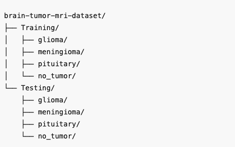

# 🧠 Brain Tumor Classification from MRI Scans using Deep Learning (PyTorch)

This repository contains a deep learning project for the classification of brain tumors from MRI images. The model is implemented using **PyTorch** and classifies brain scans into one of the following categories:

- **Glioma**
- **Meningioma**
- **Pituitary Tumor**
- **No Tumor**

---

## 🔬 Project Highlights

- ✅ Custom **CNN architecture** trained from scratch.
- ✅ Advanced **data augmentation** and preprocessing using `torchvision.transforms`.
- ✅ Visualizations for training: **loss and accuracy curves**.
- ✅ Evaluation metrics: **accuracy, precision, recall, F1-score**, **confusion matrix**, and **ROC-AUC**.
- ✅ Inference support: Predict on **unseen MRI images** with class-wise confidence.
- ✅ Modular code for training, validation, evaluation, and prediction.

---

## 📁 Dataset Structure

The dataset used is structured into `Training` and `Testing` folders with subdirectories for each class:  

## 📊 Results

- High classification accuracy
- Confusion matrix and per-class ROC-AUC
- Class distribution and confidence statistics for unseen MRI predictions

---

## 🧪 Technologies Used

- `Python 3.x`
- `PyTorch`
- `Torchvision`
- `Scikit-learn`
- `Matplotlib`

